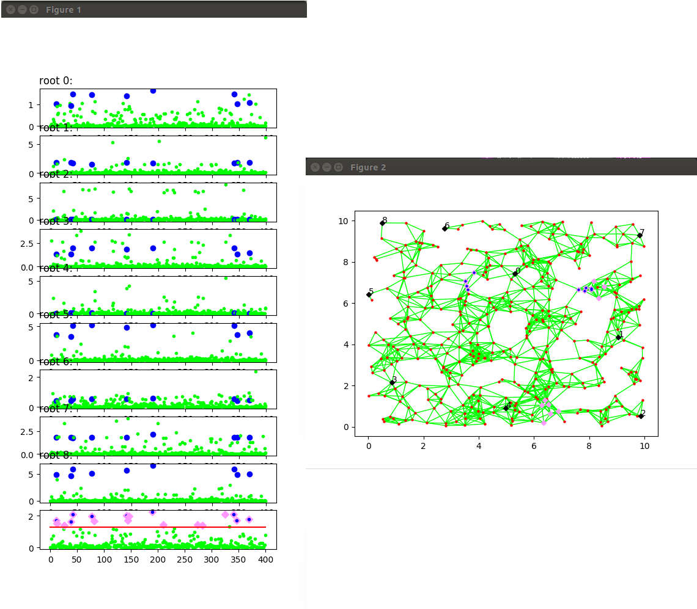

Wormhole Detection in WSNs Using Spanning Trees
============================================
This repository contains the python code for creating an arbitrary wireless sensor network, inserting a wormhole into the network and a detection algorithm for identifying the affected sensors. The detection approach was described in the following paper:
Károly Harsányi, Attila Kiss, Tamás Szirányi: 
[Wormhole detection in wireless sensor networks using spanning trees](https://ieeexplore.ieee.org/document/8325596/),
[2018 IEEE International Conference on Future IoT Technologies (Future IoT)](https://ieeexplore.ieee.org/xpl/mostRecentIssue.jsp?punumber=8322493).


### Requirements
- python 3.5 or 3.6
- matplotlib
- numpy
- networkx
- scipy


### Guide
The following command deploys a wireless sensor network with random deployment and quasi-unit-disk-graph communication model into a 10x10 area. The number of sensors is 400 and the communication radius of the nodes is 1.2. The adversary's radio receivers have a radius of 0.6 and they are placed with at least 6 hop-distance between them. k and th (lambda) are the parameters of the detection algorithm (see the aforementioned article). Make_plot=True visualizes the results. If make_plot is set to False, the output is a simple confusion matrix.
```sh
python3 detect_wormhole.py -deployment_type=random -communication_model=QUDG -num_nodes=400 -comm_radius=1.2 -side_len=10 -wormhole_type=3 -wormhole_radius=0.6 -wormhole_min_dist=6 -k=7 -th=5 -make_plot=True
```
See
```sh
python3 detect_wormhole.py -h
```
for more information about the arguments


## Example for displayed plot:
Figure 1 shows the classification results from the different root nodes, and Figure 2 shows the network layout with the wormhole nodes and the predicted wormhole nodes colored blue and pink respectively.



